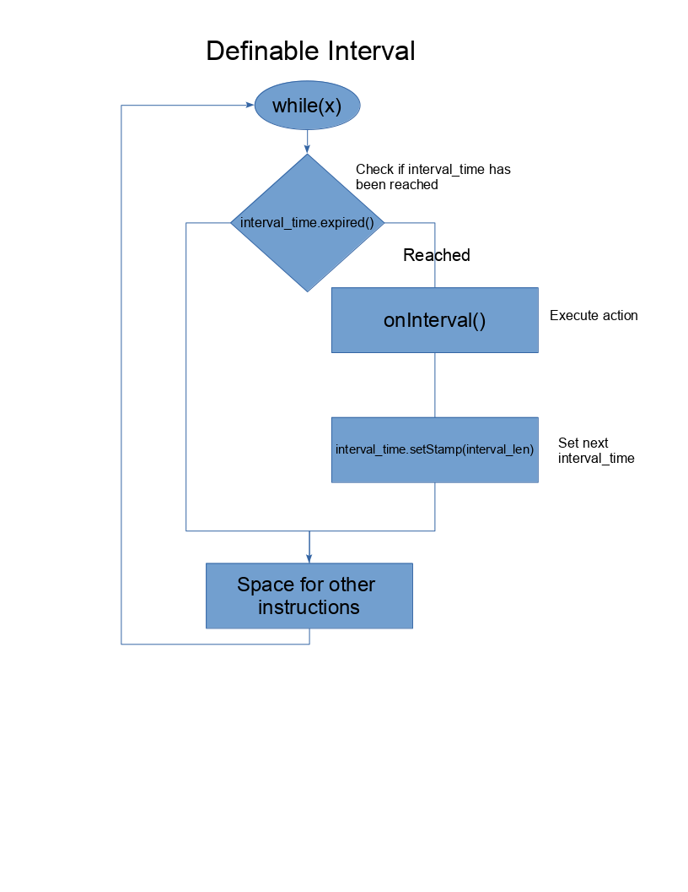

# Arduino Interval Library
By Patrick Pedersen

The goal of this library is to provide a solution for tasks that require some kind of interval pattern,
while barely interfearing with the entire runtime time process ulike delays. This is done by Protothreading using time stamps that get checked 
in an regulare pattern, being the interval. For simple time stamp interreaction, use the time_stamp class that is packed with various 
useful functions for time_stamp reading and writing. To build a interval, create an instance of definable_interval and refference onInterval to your
desired function. This function is then executed on every interval. To start a interval, execute the interval() member function inside of your desired loop.
The function will not delay runtime, instead it will skip until the next interval.



### Usage

Including the library :

```cpp
#include <Interval.h>
```

Defining a interval with a length of 1 second that executes function f:

```cpp
void f() {
...
}

definable_interval interval(1000, &f):
```

### Example

Interval that prints "Hello" to the serial output every second while printing the state of pin D3 D4 D5 and D6. No delays involved!

```cpp
#include <Interval.h>

/* Will be called on Interval */
void hello() {
	Serial.println("Hello");
}

/* Interval that print hello every second */
definable_interval hello_interval(1000, &hello);

void setup() {
	for (int i = 0; i <= 6; i++) {
		pinMode(i, INPUT);
	}

	Serial.begin(9600);
}

void loop() {
	/* Check and execute interval */
	hello_interval.interval();

	/* No delay */

	/* Print Pin states */
	for (int i =0; i <= 6; i++) {
		Serial.println(digitalRead(i);
	}
}
